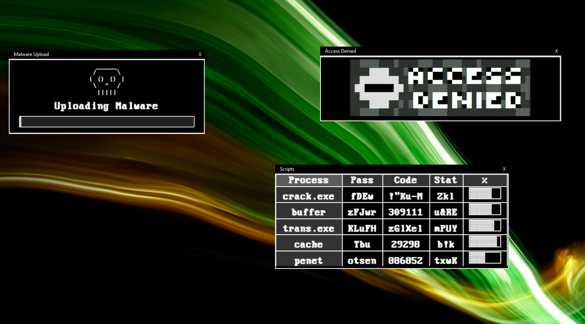

# Fake-Hacking-Popups
Inspired by https://hacker-simulator.com/

1. Install Requirements.txt This Includes

Tkinter: Tkinter is Python's standard GUI (Graphical User Interface) toolkit, which should be included with most Python installations by default. However, if you encounter any issues, you might need to install it separately.

Pillow: Pillow is a Python Imaging Library (PIL) fork, which is used here to work with images, including opening GIF files. You can install Pillow via pip if you haven't already

ImageMagick (Optional): The script uses the ImageSequence.Iterator() method from Pillow to iterate over the frames of the GIF images. In some cases, Pillow might require ImageMagick to be installed on your system to work with certain types of images. If you encounter issues with GIF loading, you might need to install ImageMagick and ensure it's accessible from your Python environment.

2. run the python file

Example:

note: The script should work on most operating systems supported by Python and Tkinter, including Windows, macOS, and Linux.
